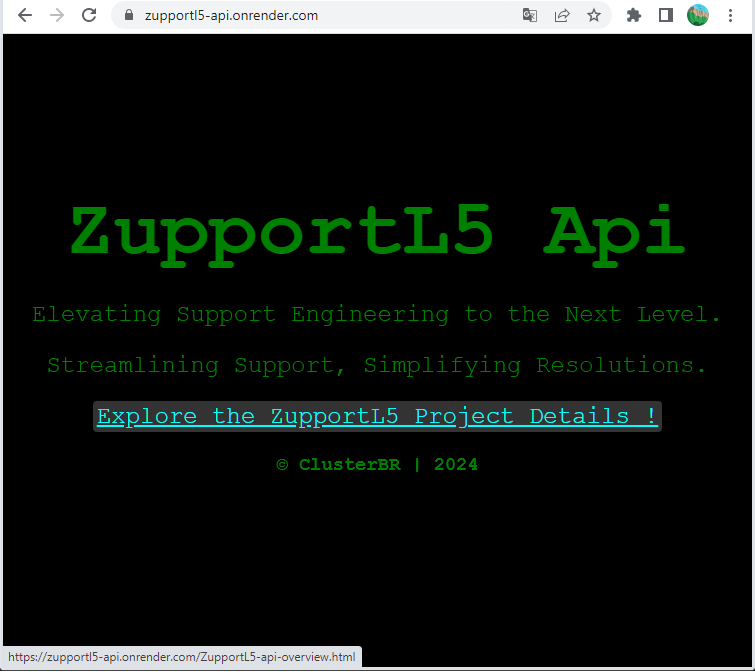

# ZupportL5-api

Elevating Support Engineering to the Next Level | Streamlining Support, Simplifying Resolutions.

## ZupportL5-api DocHub

This repository hosts the public documentation for the **ZupportL5-api** project.

### Javadoc Version 1.1

<ul>
<li>Main Api documentation: 
<a target="_blank" href="https://abritoh.github.io/zupportl5-api-dochub/1.0/apidocs">https://abritoh.github.io/zupportl5-api-dochub/1.0/apidocs</a>
</li>
<li>Test Api documentation: 
<a target="_blank" href="https://abritoh.github.io/zupportl5-api-dochub/1.0/testapidocs">https://abritoh.github.io/zupportl5-api-dochub/1.0/testapidocs</a>
</li>
</ul>


## ZupportL5-Api online
_

> Explore ZupportL5-api at (**Google App Engine**): https://zupportl5.uc.r.appspot.com


___


[](https://zupportl5.uc.r.appspot.com)

___


```bash
___________________________________________________________________________

 ______                             _   _      _____                   _ 
|___  /                            | | | |    |  ___|                 (_)
   / / _   _ _ __  _ __   ___  _ __| |_| |    |___ \ ______ __ _ _ __  _ 
  / / | | | | '_ \| '_ \ / _ \| '__| __| |        \ \______/ _` | '_ \| |
./ /__| |_| | |_) | |_) | (_) | |  | |_| |____/\__/ /     | (_| | |_) | |
\_____/\__,_| .__/| .__/ \___/|_|   \__\_____/\____/       \__,_| .__/|_|
            | |   | |                                           | |      
            |_|   |_|                                           |_|      

__________________________________________________
   ________           __            ____  ____ 
  / ____/ /_  _______/ /____  _____/ __ )/ __ \
 / /   / / / / / ___/ __/ _ \/ ___/ __  / /_/ /
/ /___/ / /_/ (__  ) /_/  __/ /  / /_/ / _, _/ 
\____/_/\__,_/____/\__/\___/_/  /_____/_/ |_|  
__________________________________________________

___________________________________________________________________________

```


